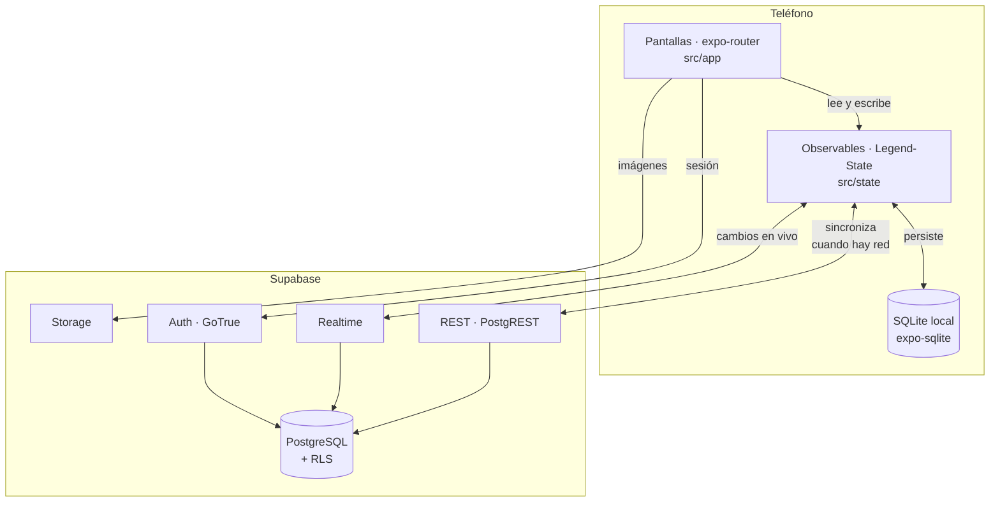

<div align="center">


# Integra

**Tu expediente médico, siempre contigo.**

Aplicación móvil de expediente médico personal. Funciona sin conexión y se sincroniza sola cuando hay internet.


</div>

---

## Qué es Integra

Integra le da a una persona el control de su propia historia clínica. En vez de depender de papeles sueltos, recetas arrugadas y la memoria de la última consulta, todo vive en el teléfono: los medicamentos y sus horarios, las tomas del día, las mediciones de presión o glucosa, las citas, las alergias, las condiciones crónicas y los contactos de emergencia.

Está pensada para pacientes con tratamientos continuos —hipertensión, diabetes, terapias de varios meses— y para las personas que los acompañan. Por eso hay tres decisiones que atraviesan todo el proyecto:

**Funciona sin conexión.** Una alarma de medicación que necesita internet para avisarte no sirve. La aplicación lee y escribe contra una base local en el teléfono, y sincroniza en segundo plano cuando hay red. Sin conexión no se degrada: funciona igual.

**Los datos son del paciente.** Cada fila de cada tabla está protegida por políticas de seguridad a nivel de fila en Postgres, comparadas contra el identificador de la sesión. No hay un servidor intermedio con acceso amplio que haya que auditar.

**La emergencia no necesita permiso.** El expediente se puede exportar como código QR y como carnet imprimible, para que un paramédico o un médico de guardia lea alergias, condiciones y contactos sin instalar nada y sin depender de que haya señal.

---

## Arquitectura

Integra es **local-first**. La pantalla nunca le habla a la red: le habla a un observable en memoria, respaldado por SQLite. Un motor de sincronización se encarga de reconciliar ese estado con Postgres cuando se puede.



### El flujo, en concreto

| Situación | Qué pasa |
|---|---|
| **Con conexión** | Carga lo local → pide los cambios desde el último sync → actualiza lo local → escucha cambios en vivo |
| **Sin conexión** | Carga lo local → las escrituras se resuelven localmente y quedan en cola |
| **Vuelve la conexión** | La cola se envía, el servidor responde con lo que cambió, y ambos lados quedan iguales |

No hay código que llame a un endpoint a mano. La capa de sincronización lo hace sola, y la pantalla ni se entera.

### Las cuatro capas

| Capa | Carpeta | Responsabilidad |
|---|---|---|
| **Presentación** | `src/app`, `src/components`, `src/features` | Rutas, composición y componentes. Sin reglas de negocio. |
| **Estado** | `src/state` | Observables, consultas derivadas y mutaciones. Toda la lógica de dominio. |
| **Infraestructura** | `src/lib` | Cliente de Supabase, configuración de sincronización, Storage, fechas, IDs. |
| **Datos** | `db/`, `drizzle/` | Esquema en Drizzle (fuente de verdad) y migraciones SQL. |

La regla que las mantiene separadas: **una pantalla puede leer estado y componer; no puede derivar datos ni hablar con la red.** Si un archivo de `features/` no importa React, pertenece a `state/`.

---

## Stack y dependencias

### Núcleo

| Paquete | Versión | Para qué |
|---|---|---|
| `expo` | ~54.0.35 | Plataforma y herramientas |
| `react-native` | 0.81.5 | Runtime móvil (New Architecture activada) |
| `react` | 19.1.0 | — |
| `expo-router` | ~6.0.24 | Navegación por archivos |
| `typescript` | ~5.9.2 | `strict: true` |

### Estado y datos

| Paquete | Versión | Para qué |
|---|---|---|
| `@legendapp/state` | ^3.0.0-beta.48 | Observables y motor de sincronización |
| `@supabase/supabase-js` | ^2.112.2 | Cliente de Auth, REST, Realtime y Storage |
| `expo-sqlite` | ~16.0.10 | Persistencia local y almacenamiento de sesión |
| `drizzle-orm` / `drizzle-kit` | ^0.45.2 / ^0.31.10 | Esquema y migraciones (solo en desarrollo) |

### Interfaz

| Paquete | Versión | Para qué |
|---|---|---|
| `nativewind` | ^4.2.6 | Tailwind sobre React Native |
| `tailwindcss` | ^3.4.17 | Sistema de diseño |
| `lucide-react-native` | ^1.31.0 | Iconografía |
| `react-native-reanimated` | ~4.1.1 | Animaciones |
| `react-native-gesture-handler` | ~2.28.0 | Gestos |
| `react-native-svg` | 15.12.1 | Gráficos vectoriales |
| `react-native-chart-kit` | ^7.0.2 | Gráficas de evolución de mediciones |
| `react-native-calendars` | ^1.1314.0 | Calendario de citas |

### Formularios

| Paquete | Versión | Para qué |
|---|---|---|
| `react-hook-form` | ^7.84.0 | Manejo de formularios |
| `zod` | ^4.4.3 | Validación de esquemas |
| `@hookform/resolvers` | ^5.7.1 | Puente entre los dos |

### Capacidades del dispositivo

| Paquete | Versión | Para qué |
|---|---|---|
| `expo-image-picker` | ~17.0.11 | Selección de foto de perfil |
| `base64-arraybuffer` | ^1.0.2 | Conversión para subir a Storage |
| `expo-print` | ~15.0.8 | Carnet de emergencia y expediente en PDF |
| `expo-sharing` | ~14.0.8 | Compartir los PDF generados |
| `react-native-qrcode-svg` | ^6.3.21 | Código QR de emergencia |
| `expo-brightness` | ~14.0.8 | Subir el brillo al mostrar el QR |
| `expo-crypto` | ~15.0.9 | Generación de UUID |

---

## Variables de entorno

Se leen desde `.env.local` en la raíz del proyecto. **Ese archivo no se versiona.**

```bash
# Cliente — se empaquetan en la aplicación
EXPO_PUBLIC_SUPABASE_URL=https://<tu-proyecto>.supabase.co
EXPO_PUBLIC_SUPABASE_KEY=<clave-anon-publishable>

# Solo herramientas de desarrollo — nunca llega al teléfono
DATABASE_URL=postgresql://postgres:<password>@<host>:5432/postgres
```

### Qué significa cada prefijo

**`EXPO_PUBLIC_*`** queda incrustado en el paquete de la aplicación en tiempo de compilación. Cualquiera que descompile el binario las puede leer. Por eso ahí va únicamente la clave **anónima**, que por sí sola no da acceso a nada: toda la autorización real la imponen las políticas de seguridad a nivel de fila en Postgres.

**`DATABASE_URL`** la usa exclusivamente `drizzle-kit` desde tu máquina para generar y aplicar migraciones. Es una credencial de superusuario de la base. Nunca se referencia desde `src/`.

> Nunca pongas la clave `service_role` en una variable `EXPO_PUBLIC_*`. Esa clave ignora todas las políticas de seguridad.

---

## Estructura modular

El código vive en `integra-app/integra-app/`. **Todas las rutas de este documento son relativas a esa carpeta**, salvo `README.md` y `DESPLIEGUE.md`, que están en la raíz del repositorio.

```
integra-app/integra-app/
├── assets/                  Iconos, fuentes e imágenes
├── db/
│   ├── schema.ts            Esquema en Drizzle — FUENTE DE VERDAD
│   └── SCHEMA.md            Notas del modelo de datos
├── drizzle/                 Migraciones SQL generadas (26 al día de hoy)
├── supabase/
│   └── functions/           Edge Functions (Deno)
└── src/
    ├── app/                 Rutas de expo-router
    │   ├── (auth)/          Login y registro
    │   └── (tabs)/          Inicio · Medicación · Mediciones · Citas · Expediente
    ├── components/          Componentes genéricos, sin dominio
    ├── features/            Componentes y esquemas Zod, agrupados por dominio
    │   ├── alergias/
    │   ├── articulos/
    │   ├── citas/
    │   ├── condiciones/
    │   ├── contactos-emergencia/
    │   ├── emergencia/      Armado del QR y carnet imprimible
    │   ├── exportaciones/
    │   ├── medicamentos/
    │   ├── mediciones/
    │   └── perfil/
    ├── hooks/               Hooks reutilizables
    ├── lib/                 Infraestructura
    │   ├── supabase.ts      Cliente y persistencia de sesión
    │   ├── sync.ts          Fábrica de tablas sincronizadas
    │   ├── almacenamiento.ts  Envoltura de Storage
    │   ├── fechas.ts        Utilidades de fecha y hora
    │   └── ids.ts           Generación de UUID
    ├── state/               Observables, consultas y mutaciones
    │   ├── *.ts             Una tabla por archivo
    │   ├── *-acciones.ts    Mutaciones de dominio
    │   └── consultas.ts     Helpers genéricos de consulta
    └── theme/               Espejo de la paleta para APIs que no aceptan clases
```

`features/` se agrupa **por dominio**, no por tipo de archivo: el esquema de validación y los componentes de un mismo dominio viven juntos.

### Documentación complementaria

| Archivo | Contenido |
|---|---|
| [`DESPLIEGUE.md`](DESPLIEGUE.md) | Cómo llevar la aplicación y el backend a producción |
| `CLAUDE.md` | Convenciones del proyecto y guía de contribución |
| `src/state/STATES.md` | Cómo funciona la capa local-first |
| `src/lib/LIB.md` | Configuración de Supabase y Legend-State |
| `db/SCHEMA.md` | Notas del modelo de datos |
| `QR-EMERGENCIA.md` | Especificación del QR de emergencia |
| `docs/` | Documentación técnica extendida por carpeta |

---

## Modelo de datos

Doce tablas en el esquema `public`, todas con RLS habilitado.

| Tabla | Contenido |
|---|---|
| `perfiles` | Datos del paciente. Se crea sola por *trigger* al registrarse. |
| `condiciones` | Condiciones crónicas y diagnósticos |
| `alergias` | Alergias con su severidad |
| `contactosemergencia` | A quién llamar |
| `medicamentos` | Tratamientos, con sus horarios en `jsonb` |
| `tomas` | Dosis individuales generadas a partir de los horarios |
| `tipomedicion` | Catálogo de tipos de medición (presión, glucosa…) |
| `mediciones` | Valores registrados por el paciente |
| `citas` | Citas médicas programadas |
| `citas_resultado` | Qué pasó en cada cita |
| `exportaciones_expediente` | Registro de expedientes compartidos |
| `articulos` | Contenido educativo. Única tabla de lectura pública. |

**Toda tabla lleva tres columnas obligatorias:** `created_at`, `updated_at` y `deleted`. Las necesita el motor de sincronización — las dos primeras para saber qué cambió desde la última vez, la tercera para el borrado suave.

El **borrado suave** es la norma: nada se elimina físicamente. `deleted = true` saca la fila de todas las consultas y permite que el borrado se propague a los demás dispositivos.

---

## Cómo funcionan los endpoints

Supabase **no tiene un backend escrito a mano**. Genera su API automáticamente a partir del esquema de Postgres: creás una tabla y en ese mismo instante existen sus endpoints REST. La autorización no vive en el código de la API, vive en las políticas de la base.

Hay cuatro servicios, cada uno con su prefijo:

| Servicio | Prefijo | Para qué |
|---|---|---|
| **Auth** (GoTrue) | `/auth/v1` | Registro, inicio de sesión, refresco de token |
| **REST** (PostgREST) | `/rest/v1` | Lectura y escritura de tablas |
| **Realtime** | `/realtime/v1` | Cambios en vivo por WebSocket |
| **Storage** | `/storage/v1` | Archivos |

Todas las peticiones llevan dos cabeceras:

```http
apikey: <EXPO_PUBLIC_SUPABASE_KEY>
Authorization: Bearer <access_token_del_usuario>
```

La `apikey` identifica al proyecto. El `Bearer` identifica al usuario, y es de donde Postgres saca `auth.uid()` para evaluar las políticas.

### 1. Autenticación

```http
POST /auth/v1/signup
Content-Type: application/json

{
  "email": "paciente@ejemplo.com",
  "password": "••••••••",
  "data": { "nombre": "Ana", "apellidos": "Rojas" }
}
```

```http
POST /auth/v1/token?grant_type=password

{ "email": "paciente@ejemplo.com", "password": "••••••••" }
```

Responde con `access_token` (vigencia corta), `refresh_token` y los datos del usuario.

**Cómo lo usa el proyecto:** las pantallas llaman `supabase.auth.signUp()` y `supabase.auth.signInWithPassword()`. La sesión se guarda en SQLite mediante `expo-sqlite/kv-store` y el token se refresca solo, pausándose cuando la aplicación pasa a segundo plano (`src/lib/supabase.ts`). Un observador central en `src/state/auth.ts` escucha los cambios de sesión y limpia la caché local al cerrar sesión.

Al registrarse, un *trigger* en `auth.users` crea automáticamente la fila correspondiente en `perfiles`.

### 2. Datos — PostgREST

Cada tabla se expone en `/rest/v1/<tabla>`, con los filtros como parámetros de consulta.

**Leer solo lo que cambió** (lo que hace el motor de sincronización en cada arranque):

```http
GET /rest/v1/medicamentos?select=*&updated_at=gt.2026-08-25T14:03:11.000Z
```

**Crear o actualizar** (inserción con resolución de duplicados):

```http
POST /rest/v1/tomas
Prefer: resolution=merge-duplicates,return=representation

[{ "id": "...", "perfil_id": "...", "medicamento_id": "...",
   "programada_para": "2026-08-25T08:00:00Z", "estado": "pendiente" }]
```

**Borrado suave** (no se usa `DELETE`):

```http
PATCH /rest/v1/medicamentos?id=eq.<uuid>

{ "deleted": true }
```

**Filtros más usados:** `eq` (igual), `gt` / `gte` (mayor), `lt` / `lte` (menor), `in`, `is`, `order`, `limit`.

> **Lo importante:** no hace falta filtrar por `perfil_id` para estar seguro. Aunque alguien pida `GET /rest/v1/mediciones` sin ningún filtro, Postgres solo devuelve las filas del usuario del token, porque la política lo obliga. El filtro por perfil que sí existe en el código es una protección **adicional** contra la caché local compartida entre dos personas en el mismo teléfono.

#### Las políticas de seguridad

Cada tabla lleva tres políticas con la misma forma:

```sql
create policy "mediciones_select_propio"
  on mediciones for select to authenticated
  using (auth.uid() = perfil_id);
```

`auth.uid()` sale del token. Si no coincide con `perfil_id`, la fila no existe para esa petición.

`articulos` es la excepción: tiene lectura pública porque es contenido educativo igual para todos.

#### Cómo lo usa el proyecto

**La aplicación nunca escribe estas URL.** Se declara una tabla sincronizada y la capa de Legend-State traduce las operaciones sobre el observable a peticiones HTTP:

```ts
// src/state/medicamentos.ts
export const medicamentos$ = observable<Record<string, Medicamento>>(syncedTable({
    collection: 'medicamentos',
    actions: ['read', 'create', 'update'],
    initial: {},
    realtime: true,
    persist: { name: 'medicamentos' },
}))
```

A partir de ahí, la equivalencia es directa:

| Lo que escribís en la aplicación | Lo que sale a la red |
|---|---|
| `useValue(medicamentos$)` | Nada. Lee de memoria y SQLite. |
| Arranque de la aplicación | `GET /rest/v1/medicamentos?updated_at=gt.<ultimo-sync>` |
| `medicamentos$[id].set({...})` | `POST /rest/v1/medicamentos` con `merge-duplicates` |
| `medicamentos$[id].assign({ activo: false })` | `PATCH /rest/v1/medicamentos?id=eq.<id>` |
| `medicamentos$[id].delete()` | `PATCH` con `{ "deleted": true }` |
| Cambio hecho en otro dispositivo | Llega por WebSocket, sin petición |

La configuración global vive en `src/lib/sync.ts`: qué columnas son las de tiempo, cuál marca el borrado, reintento infinito, y una espera a que exista sesión antes de sincronizar nada.

### 3. Tiempo real

```
wss://<proyecto>.supabase.co/realtime/v1/websocket
```

Con `realtime: true` en una tabla, el cliente se suscribe a sus cambios y el observable se actualiza solo cuando otro dispositivo escribe. Es la misma conexión para todas las tablas.

### 4. Storage

```http
POST   /storage/v1/object/avatares/<uid>/<uuid>.jpg     Subir
GET    /storage/v1/object/public/avatares/<uid>/<uuid>.jpg   Leer (bucket público)
DELETE /storage/v1/object/avatares/<uid>/<uuid>.jpg     Borrar
```

Los permisos también son políticas de Postgres, sobre la tabla `storage.objects`:

```sql
create policy "avatares_subir_propio"
  on storage.objects for insert to authenticated
  with check (
    bucket_id = 'avatares'
    and (storage.foldername(name))[1] = auth.uid()::text
  );
```

La ruta empieza con el identificador del usuario, y esa política exige que la primera carpeta coincida con quien hace la petición. Nadie puede escribir en la carpeta de otro.

**Cómo lo usa el proyecto:** `src/lib/almacenamiento.ts` envuelve las tres operaciones. En React Native no existe el objeto `File`, así que la imagen se lee en base64 y se convierte a `ArrayBuffer` antes de subirla. La base de datos guarda la **ruta**, nunca la URL completa, para que cambiar de proyecto o de bucket no rompa los datos.

---

## Scripts

```bash
npm start            # Servidor de desarrollo
npm run android      # Compilar y correr en Android
npm run ios          # Compilar y correr en iOS
npm run web          # Correr en navegador
```

Base de datos:

```bash
npx drizzle-kit generate   # Genera la migración a partir de db/schema.ts
npx drizzle-kit migrate    # Aplica las migraciones pendientes
```

> **Siempre revisá el `.sql` generado antes de aplicarlo.** Cuando se renombra una columna *y* se le cambia el tipo en la misma edición, `drizzle-kit` genera solo el `RENAME` y se come el cambio de tipo, sin avisar.

---

## Puesta en marcha

```bash
git clone https://github.com/mrstevengz/Integra.git
cd Integra/integra-app/integra-app
npm install
```

Creá `.env.local` con las tres variables de la sección anterior y aplicá el esquema:

```bash
npx drizzle-kit migrate
```

Después, en el panel de Supabase, creá el bucket `avatares` como público con sus cuatro políticas de acceso.

```bash
npm start
```

Se abre en Expo Go escaneando el código QR, o con `npm run android` / `npm run ios` para una compilación de desarrollo.

---

## Despliegue

Publicar Integra son tres piezas separadas, y en este orden:

| Pieza | Con qué se publica |
|---|---|
| Esquema de la base | `drizzle-kit migrate` contra el proyecto de producción |
| Edge Function `expediente` | Supabase CLI |
| Aplicación móvil | EAS Build → Google Play y App Store |

El procedimiento completo —configuración de EAS, variables de entorno en la nube, políticas de producción, actualizaciones OTA, lista de verificación y marcha atrás— está en **[DESPLIEGUE.md](DESPLIEGUE.md)**.

> Antes de la primera compilación hay tres puntos a resolver que hacen fallar la build o degradan el resultado: los íconos en SVG, el identificador de iOS que falta, y la familia tipográfica que no resuelve. Están detallados al inicio de esa guía.

---

## Convenciones

**Todo en español**: variables, funciones, tipos, archivos, carpetas y texto de interfaz. Las excepciones son las que impone el entorno — APIs de terceros, carpetas de primer nivel, y los nombres de columna, que ya están en español y coinciden carácter por carácter con los campos de los tipos de fila porque el plugin de sincronización lee y escribe filas crudas.

| Elemento | Convención | Ejemplo |
|---|---|---|
| Archivos que no son componentes | `kebab-case` | `contactos-emergencia.ts` |
| Componentes de React | `PascalCase` | `ProximaCita.tsx` |
| Tipos y componentes | `PascalCase` singular | `ContactoEmergencia` |
| Funciones y variables | `camelCase` | `medicamentosActivos` |
| Observables | `camelCase` plural + `$` | `alergias$` |
| Constantes de módulo | `SCREAMING_SNAKE_CASE` | `DIAS_ATRAS` |
| Predicados | prefijo `es` / `tiene` / `esta` | `estaVencida` |

Los detalles completos están en `CLAUDE.md`.

---

<div align="center">
<sub>Integra · Expediente médico personal</sub>
</div>
