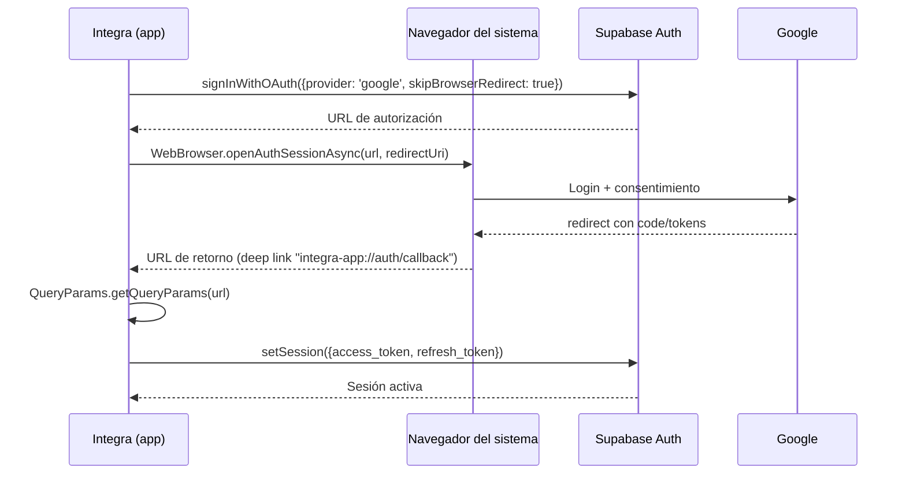
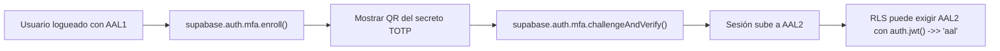
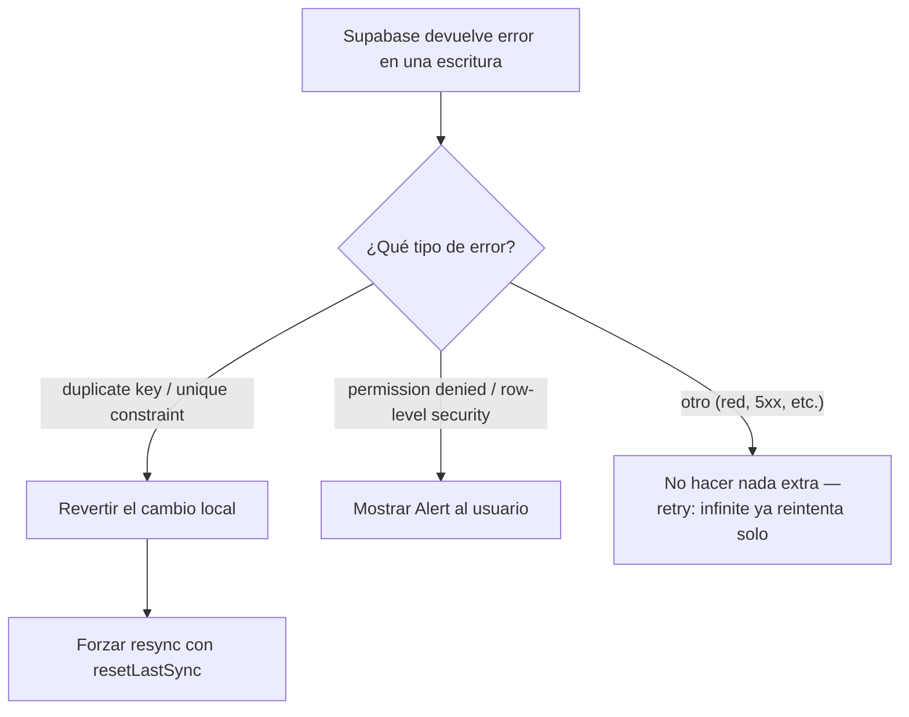
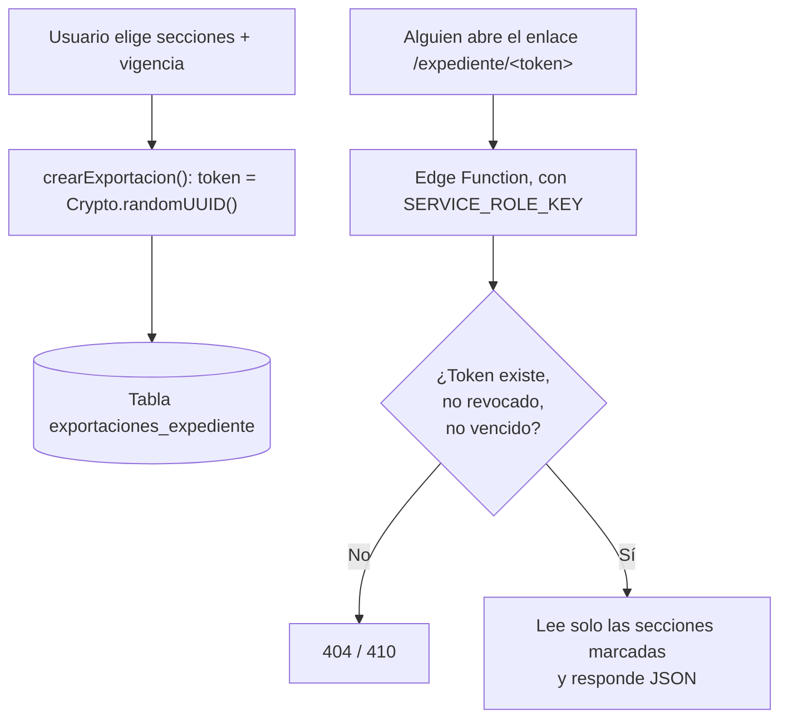
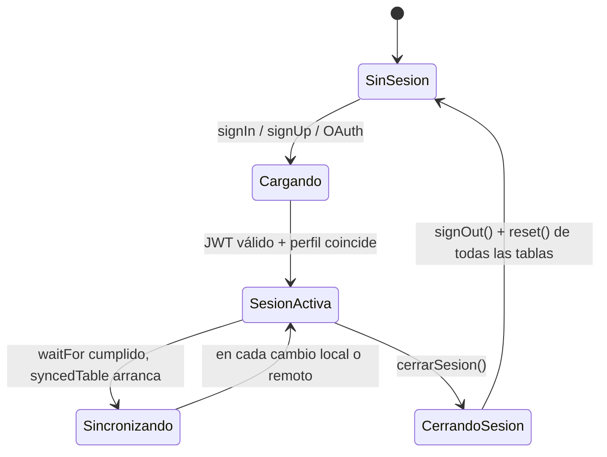

# Seguridad, autenticación y manejo de estados

> Qué protege a los datos de un usuario de otro, qué pasa cuando algo falla, y quién es
> responsable de cada capa: Integra o Supabase.
>
> **Última actualización:** 2026-09-05

---

## 0. Resumen ejecutivo

Integra es una app **local-first**: casi todo el trabajo pesado de seguridad (autenticación,
autorización a nivel de fila, transporte cifrado) lo hace **Supabase**, no código propio. El
trabajo de Integra es configurarlo bien, no reconstruirlo. Esta tabla es el mapa del documento:

| Área | Quién lo resuelve | Dónde vive en Integra |
|---|---|---|
| Verificar contraseña / emitir sesión | Supabase Auth (GoTrue) | [`src/lib/supabase.ts`](../src/lib/supabase.ts) |
| OAuth con Google | Supabase Auth + navegador del sistema | [`src/state/auth.ts`](../src/state/auth.ts) |
| Autenticación de dos factores | Supabase Auth lo soporta — **Integra no lo activa** | §1.5 |
| Guardar la sesión en el dispositivo | Supabase SDK + `expo-sqlite/kv-store` | [`src/lib/supabase.ts`](../src/lib/supabase.ts) |
| Impedir que un usuario lea la fila de otro | Postgres RLS (`auth.uid() = perfil_id`) | [`db/schema.ts`](../db/schema.ts) |
| Validar el formato de un campo antes de enviarlo | Zod + React Hook Form | `src/features/*/​*-schema.ts` |
| Rechazar un dato con el tipo equivocado igual | Constraints de Postgres (tipos, `NOT NULL`, `enum`) | `db/schema.ts` (Drizzle) |
| Enrutar según haya o no sesión | `Stack.Protected` de expo-router | [`src/app/_layout.tsx`](../src/app/_layout.tsx) |
| Compartir el expediente sin cuenta | Token propio + Edge Function | §4.5 |
| Reintentar / revertir una escritura que falló | Legend-State (`retry`, `onError`) | [`src/lib/sync.ts`](../src/lib/sync.ts) |

No hay **roles** en el sentido de admin/moderador/usuario: todo el mundo es dueño exclusivo de
su propio expediente. El único "permiso" que existe es *"esta fila es mía"*.

---

## 1. Autenticación

### 1.1 Métodos soportados

| Método | Estado | Dónde |
|---|---|---|
| Email + contraseña | ✅ Activo | `supabase.auth.signInWithPassword` / `signUp` en las pantallas de `(auth)` |
| Google (OAuth) | ✅ Activo (builds nativos) | [`src/state/auth.ts`](../src/state/auth.ts) |
| Autenticación de dos factores (MFA) | ⚠️ **Disponible en Supabase, no implementada en Integra** | §1.5 |

### 1.2 Email y contraseña

`supabase.auth.signInWithPassword({ email, password })` — Supabase valida la contraseña contra
el hash que guarda (bcrypt, del lado del servidor; Integra nunca ve ni guarda contraseñas en
texto plano) y devuelve un JWT firmado. Si falla, `error.message` ya viene en un texto usable:

```ts
// src/app/(auth)/login.tsx
const { error } = await supabase.auth.signInWithPassword({
  email: formValues.email,
  password: formValues.password,
});
if (error) setError(error.message);
```

### 1.3 Google OAuth — por qué usa el navegador del sistema y no un WebView



```ts
// src/state/auth.ts
const resultado = await WebBrowser.openAuthSessionAsync(data.url ?? '', URL_REDIRECCION)
```

**Por qué importa `WebBrowser.openAuthSessionAsync` y no un `WebView` embebido:** el navegador
del sistema (Safari/Chrome) es un proceso separado de la app. Un WebView dentro de la propia app
podría, en teoría, leer las cookies y el formulario de login de Google — es la razón por la que
Google bloquea el login dentro de WebViews genéricos. El navegador del sistema es la superficie
que Google confía y la que Expo recomienda para OAuth.

### 1.4 Sesión: dónde vive y cómo se refresca

```ts
// src/lib/supabase.ts
export const almacenamientoAuth = new SQLiteStorage('supabase-auth')

export const supabase = createClient<Database>(url, key, {
    auth: {
        storage: almacenamientoAuth,   // persiste el JWT en SQLite local
        autoRefreshToken: true,        // pide un access_token nuevo antes de que expire
        persistSession: true,
        detectSessionInUrl: false      // no aplica en RN, no hay URL de navegador
    }
})

AppState.addEventListener('change', (state) => {
    state === 'active' ? supabase.auth.startAutoRefresh() : supabase.auth.stopAutoRefresh()
})
```

- El **access token** (JWT) es de corta duración (por defecto 1 hora en Supabase); el
  **refresh token** es el que se guarda a largo plazo y permite pedir uno nuevo sin volver a
  loguearse.
- `startAutoRefresh` / `stopAutoRefresh` según `AppState` evita refrescar tokens en segundo plano
  cuando la app está minimizada — ahorra batería y llamadas de red innecesarias.
- El estado de sesión se refleja en el observable [`auth$`](../src/state/auth.ts), que es lo que
  realmente consulta el resto de la app (ver §6).

### 1.5 Autenticación de dos factores (2FA / MFA)

**Estado real del proyecto: no implementada.** Es importante decirlo explícito para no dar una
falsa sensación de seguridad — no hay pantalla de enrolamiento, no hay challenge de código, y
`src/state/auth.ts` no llama ninguna función de `supabase.auth.mfa`.

Lo que **sí** existe es la capacidad, a nivel de plataforma, para agregarla después sin migrar de
proveedor de auth: Supabase Auth soporta MFA por TOTP (Google Authenticator, Authy, etc.) de
forma nativa. Si en algún momento se implementa, el flujo sería:



Tres piezas que faltarían, para dejarlo anotado:

1. **UI de enrolamiento** — pantalla que llame `supabase.auth.mfa.enroll({ factorType: 'totp' })`
   y muestre el QR resultante.
2. **UI de challenge** — un campo de 6 dígitos en el login que llame
   `supabase.auth.mfa.challengeAndVerify()` cuando el usuario tenga un factor activo.
3. **Decisión de política** — si se exige AAL2 para *todo* o solo para acciones sensibles
   (por ejemplo, generar un enlace de exportación del expediente). Eso se aplicaría agregando
   `auth.jwt() ->> 'aal' = 'aal2'` a las políticas RLS relevantes en `db/schema.ts`, del mismo
   modo que hoy comparan `auth.uid()`.

No hay urgencia técnica para agregarlo — es una decisión de producto sobre cuánta fricción vale
la pena para un expediente médico personal.

---

## 2. Validación de entradas

Dos capas, y **ninguna confía en la otra**: el cliente valida para dar feedback inmediato: el
servidor (Postgres) valida porque el cliente se puede evadir.

### 2.1 Capa de cliente: Zod + React Hook Form

Cada dominio de `src/features/` define su propio `*-schema.ts` con un `z.object(...)`, y las
pantallas lo conectan con `useForm({ resolver: zodResolver(schema) })`. Los mensajes de error
van en español porque los lee la persona usuaria (ver [Convención de idioma](../docs/README.md#convenciones-del-proyecto)).

```ts
// src/features/auth/registro-schema.ts
export const registroSchema = z.object({
    nombre: z.string().trim().min(2, {error: 'Ingresa tu nombre'}).max(60, {error: 'Maximo 60 caracteres'}),
    email: z.email({error: "Correo electronico invalido"}),
    fechaNacimiento: z.date({error: "Selecciona tu fecha de nacimiento"})
        .refine((d) => d <= new Date(), {error: "La fecha no puede ser futura"}),
    password: z.string().min(8, {error: "Minimo 8 caracteres"}),
    confirmar: z.string(),
    telefono: z.string().min(8, {error: 'Ingresa tu numero de telefono'}).max(20)
        .regex(/^[\d+()\s-]+$/, { error: 'Solo números, espacios y + ( ) -' }),
}).refine((v) => v.password === v.confirmar, {
    error: "Las contraseñas no coinciden",
    path: ['confirmar'],
})
```

El error de cada campo llega al componente vía `useController` y se pinta en rojo debajo del
input — ver [`CampoTexto.tsx`](../src/components/CampoTexto.tsx):

```ts
const { field, fieldState } = useController({ name, control });
const error = fieldState.error?.message;
// ...
{error && <Text className="mt-1 text-caption font-lexend text-danger">{error}</Text>}
```

Detalle de diseño defensivo en `registroSchema`: la contraseña mínima es de **8 caracteres**, sin
exigir mayúsculas/símbolos — es Supabase Auth quien realmente decide si acepta la contraseña al
hacer `signUp` (su política mínima configurable en el dashboard), así que el Zod local es una
primera barrera de UX, no la autoridad final.

Ver [09-zod-react-hook-form.md](09-zod-react-hook-form.md) para el patrón completo paso a paso.

### 2.2 Capa de servidor: constraints de Postgres

Lo que Zod no puede garantizar (porque el cliente se puede saltar, interceptar o correr con una
versión vieja) lo garantiza la base de datos:

- **Tipos de columna** (`uuid`, `boolean`, `timestamp`, `enum`) — un `tipo_resultado` inválido en
  `citas_resultado` nunca llega a insertarse, sin importar qué mande el cliente.
- **`NOT NULL`** en los campos obligatorios de `db/schema.ts`.
- **Row Level Security** — que técnicamente no es "validación de forma" sino de **pertenencia**:
  ver §4.2. Es la verdadera última línea de defensa.

### 2.3 La Edge Function no valida body — y está bien así

`supabase/functions/expediente/index.ts` es de **solo lectura** (`GET`), no recibe body de
usuario: el único input externo es el token en la URL, y se valida contra la tabla antes de
devolver nada (§4.5). No hay superficie de inyección porque no hay parsing de datos arbitrarios.

---

## 3. Manejo de errores

### 3.1 Límite de pantalla: `ErrorBoundary` de expo-router

Si un componente lanza una excepción durante el render, expo-router la atrapa a nivel de layout
en vez de tumbar toda la app:

```tsx
// src/app/_layout.tsx
export function ErrorBoundary({error, retry}: ErrorBoundaryProps) {
  return (
    <View className="flex-1 items-center justify-center px-6">
      <Text className="text-lg font-semibold mb-2">Algo salio mal</Text>
      <Text className="text-slate-500 text-center mb-6">{error.message}</Text>
      <Pressable onPress={retry} className="bg-black py-3 px-6 rounded-lg">
        <Text className="text-white">Reintentar</Text>
      </Pressable>
    </View>
  )
}
```

Esto cubre errores de **render** (un `undefined.algo`, un componente que explota). No cubre
errores de red o de sincronización — esos los maneja Legend-State (§3.2).

### 3.2 Errores de sincronización: `onError` en `sync.ts`

Cada tabla sincronizada pasa por el mismo manejador central. Cuando Supabase rechaza una
escritura, Legend-State no la descarta: la clasifica.



```ts
// src/lib/sync.ts
onError: (error, params) => {
    console.error(`[sync:${params.source}]`, error.message)
    const msg = error.message ?? ''

    if (esConflictoDeClave(msg)) {
        params.revert?.()
        // fuerza a Legend-State a traer de nuevo el estado real del servidor
        syncState(params.setParams?.value$).sync({ resetLastSync: true })
        return
    }

    if (esErrorDePermisos(msg)) {
        Alert.alert('Error de sincronizacion', 'No se pudo guardar en el servidor. Intente mas tarde')
    }
}
```

Por qué **conflicto de clave** se revierte en vez de reintentar: significa que otro dispositivo
ya creó esa fila primero (dos teléfonos con el mismo usuario, por ejemplo). Reintentar la misma
escritura fallaría para siempre; revertir y volver a sincronizar trae la versión real del
servidor. Es un caso [documentado como abierto](05-carpeta-state-legend-state.md#58-problema-abierto-conflicto-de-clave-única)
para `generarTomasPendientes()`.

Por qué **error de permisos** sí interrumpe con un `Alert`: normalmente significa que la sesión
expiró o la fila ya no le pertenece al usuario — no tiene sentido seguir reintentando en
silencio algo que RLS va a rechazar siempre.

Todo lo demás (caídas de red, 5xx, la incidencia de reloj de PostgREST) se apoya en
`retry: {infinite: true}` — no necesita lógica propia porque el próximo intento suele resolverlo.

### 3.3 Errores de formulario en pantalla

Patrón repetido en las pantallas de auth: un `useState<string | null>` local para el mensaje de
error del intento (distinto del error de *validación* de campo, que maneja Zod):

```ts
// src/app/(auth)/login.tsx
const [error, setError] = useState<string | null>(null);
// ...
const { error } = await supabase.auth.signInWithPassword({ email, password });
if (error) setError(error.message);
```

### 3.4 Confirmaciones destructivas

[`src/components/Alert.tsx`](../src/components/Alert.tsx) centraliza los diálogos de
confirmación nativos para evitar que un `Pressable` borre algo sin preguntar:

```ts
export const deleteAlert = (confirm: () => void) => {
    Alert.alert('Estas seguro que quieres eliminar esta fila', 'Esta accion no puede ser revertida', [
        { text: 'Cancelar', style: 'cancel' },
        { text: 'Confirmar', onPress: () => confirm() },
    ])
}
```

---

## 4. Protección de rutas y datos (roles y permisos)

### 4.1 Guardas de navegación

Toda la app tiene **un solo punto de control de acceso**: [`src/app/_layout.tsx`](../src/app/_layout.tsx).
No hay guardas repetidas por pantalla ni por pestaña — `(tabs)/_layout.tsx` no vuelve a chequear
sesión, confía en que ya se resolvió arriba.

```tsx
<Stack.Protected guard={sesionLista}>
  <Stack.Screen name="(tabs)"/>
</Stack.Protected>

<Stack.Protected guard={!sesion}>
  <Stack.Screen name="(auth)"/>
</Stack.Protected>
```

`sesionLista` no es solo "hay sesión" — es `!!sesion && perfil.id === sesion.user.id`: evita el
instante en que ya llegó el JWT pero el perfil todavía pertenece (en caché) al usuario anterior,
que sería una ventana real de fuga de datos entre dos cuentas en el mismo teléfono.

**Esto es enrutamiento, no autorización.** Que la pantalla se muestre no significa que los datos
lleguen — eso lo decide RLS, con o sin este guard.

### 4.2 Row Level Security — el modelo de permisos real

No hay una tabla de roles ni un campo `es_admin`. El modelo entero es: **cada fila le pertenece a
exactamente un `perfil_id`, y Postgres no deja tocar filas que no son las tuyas**, sin importar
qué pida el cliente.

```ts
// db/schema.ts — patrón repetido en cada tabla propia del usuario
pgPolicy("condiciones_select_propio", {
  for: "select",
  to: authenticatedRole,
  using: sql`${authUid} = ${table.perfil_id}`,
}),
pgPolicy("condiciones_create_propio", {
  for: "insert",
  to: authenticatedRole,
  withCheck: sql`${authUid} = ${table.perfil_id}`,
}),
pgPolicy("condiciones_update_propio", {
  for: "update",
  to: authenticatedRole,
  using: sql`${authUid} = ${table.perfil_id}`,
  withCheck: sql`${authUid} = ${table.perfil_id}`,
}),
```

`using` filtra qué filas puede *ver* la operación; `withCheck` valida la fila *después* del
cambio. Hacen falta los dos: sin `withCheck` en `update`, un usuario podría intentar reasignar
`perfil_id` a otra cuenta.

No hay política de `delete` en ninguna tabla — es intencional: con `fieldDeleted` configurado en
Legend-State (§6), un borrado real nunca ocurre, siempre es un `UPDATE` que marca
`deleted = true` (ver [05-carpeta-state-legend-state.md](05-carpeta-state-legend-state.md)). Menos
superficie de permisos que mantener.

### 4.3 Dos roles de Postgres, no de la app: `anon` y `authenticated`

La mayoría de las tablas exigen `authenticated`. Dos excepciones son de **lectura pública
intencional**, porque son catálogos, no datos de un usuario:

```ts
// articulos y tipomedicion — catálogos compartidos, sin dueño
pgPolicy("articulos_lectura_publica", {
  for: "select",
  to: [anonRole, authenticatedRole],
  using: sql`true`,
}),
```

`anonRole` es el que usa la `anon key` pública (§5.2) antes de que el usuario inicie sesión.
`authenticatedRole` es cualquier JWT válido — no distingue *cuál* usuario, eso lo hace la
comparación con `perfil_id` en las políticas propias.

### 4.4 Defensa en profundidad en el cliente

RLS protege el servidor, **no el caché local**: la caché de SQLite en el dispositivo sobrevive al
cierre de sesión hasta que `cerrarSesion()` termina de limpiarla (§5.4). Por eso toda consulta
derivada del lado de la app filtra explícitamente por `perfilId` además de confiar en RLS — es la
trampa documentada en [STATES.md](../src/state/STATES.md) y en el
[CLAUDE.md](../CLAUDE.md#6-legend-state-v3) del proyecto:

> Sin ese filtro, dos personas en el mismo teléfono pueden ver datos cruzados.

### 4.5 Compartir sin sesión: el patrón de "capability URL"

El expediente exportado (`(tabs)/expediente/exportar/...`) es la única función que **debe** ser
accesible sin login — quien lo recibe no tiene cuenta en Integra. RLS no sirve acá (no hay
`auth.uid()` de por medio), así que el control de acceso se mueve al **token**:



Puntos de diseño deliberados, en [`supabase/functions/expediente/index.ts`](../supabase/functions/expediente/index.ts):

- **El token es impredecible**: `crearId()` usa `Crypto.randomUUID()` de `expo-crypto`, un
  generador criptográfico, no `Math.random()`. Adivinar un UUID v4 no es viable.
- **La Edge Function usa `SUPABASE_SERVICE_ROLE_KEY`**, que **ignora RLS a propósito** — es la
  única forma de leer filas de un `perfil_id` sin sesión. Esa clave existe *solo* en el entorno
  de la función (`Deno.env.get(...)`), nunca en el bundle de la app — ver §5.2.
- **Expiración y revocación se chequean antes de tocar los datos**:
  ```ts
  if (exportacion.revocada_en) return error('...', 410)
  if (new Date(exportacion.expira_en).getTime() <= Date.now()) return error('...', 410)
  ```
- **Mínimo privilegio por diseño**: `secciones` decide qué tablas se consultan siquiera — si el
  usuario no marcó "citas", la función ni siquiera hace esa query.
- **`Cache-Control: no-store, no-cache, must-revalidate`**: un expediente médico no debería
  quedar cacheado en un proxy o en el historial del navegador de quien lo abrió.
- **Revocar es instantáneo**: [`revocarExportacion()`](../src/state/exportaciones.ts) solo escribe
  `revocada_en`, y la Edge Function la chequea en cada request — no hay ventana de invalidación.

### 4.6 Comparativa: los dos QR del proyecto

Documentado en detalle en [`QR-EMERGENCIA.md`](../src/features/emergencia/QR-EMERGENCIA.md);
resumen de por qué tienen modelos de seguridad opuestos a propósito:

| | QR de emergencia | QR de expediente |
|---|---|---|
| Contenido | Texto plano, embebido en el QR | Nada — solo una URL con token |
| Requiere red | No (funciona sin señal) | Sí |
| Control de acceso | Ninguno — quien lo ve, lo lee | Token + expiración + revocación |
| Revocable | ❌ No, nunca | ✅ Sí, en cualquier momento |
| Qué expone | Fijo, priorizado clínicamente (alergias y contactos nunca se cortan) | El usuario elige sección por sección |

---

## 5. Desarrollo seguro

### 5.1 Secretos y variables de entorno

```
.env.local          ← NO se versiona (contiene EXPO_PUBLIC_SUPABASE_URL, EXPO_PUBLIC_SUPABASE_KEY, DATABASE_URL)
```

**Ojo con el prefijo `EXPO_PUBLIC_`**: cualquier variable con ese prefijo queda **incrustada en
el bundle de JavaScript** de la app — la puede leer cualquiera que descompile el `.apk`/`.ipa`.
Esto es aceptable únicamente porque `EXPO_PUBLIC_SUPABASE_KEY` es la **anon key**, diseñada para
ser pública (§5.2). `DATABASE_URL` (usada solo por Drizzle en build-time, nunca en runtime de la
app) **no** lleva ese prefijo — si alguna vez lo llevara, la contraseña de la base de datos
viajaría dentro del bundle.

### 5.2 Las dos claves de Supabase no son intercambiables

| Clave | Dónde vive | Qué puede hacer |
|---|---|---|
| `anon` / publishable key | Cliente (`EXPO_PUBLIC_SUPABASE_KEY`, dentro del bundle) | Solo lo que las políticas RLS permitan para `anonRole`/`authenticatedRole` |
| `service_role` key | **Solo** en el entorno de la Edge Function (`Deno.env.get`) | Ignora RLS por completo — acceso total a la base |

Que la `anon key` esté en el cliente **no es una fuga** — es el diseño de Supabase: la seguridad
real vive en las políticas RLS, no en ocultar esa clave. La `service_role` key sí sería una fuga
grave si terminara en el cliente, porque anula toda la protección de §4.2. En este proyecto nunca
sale del servidor de Edge Functions.

### 5.3 OAuth en navegador del sistema, no en WebView

Cubierto en §1.3 — vale la pena repetirlo como principio general: **cualquier login de terceros
en Integra debe abrir el navegador del sistema** (`expo-web-browser`), nunca un `WebView`
embebido. Es la diferencia entre que Google confíe en el flujo o lo bloquee, y entre que la app
pueda leer las credenciales que se tipean o no.

### 5.4 Qué pasa con los datos locales al cerrar sesión

```ts
// src/state/auth.ts
async function limpiarDatosLocales() {
    await Promise.all(
        getAllSyncStates().map(([syncState$]) => syncState$.reset())
    )
}

export async function cerrarSesion() {
    auth$.cerrandoSesion.set(true)   // bloquea la navegación mientras limpia
    try {
        await supabase.auth.signOut()   // invalida el refresh token en el servidor
        await limpiarDatosLocales()      // borra el caché de SQLite de cada tabla
    } finally {
        auth$.cerrandoSesion.set(false)
    }
}
```

`auth$.cerrandoSesion` existe específicamente para que la UI no navegue a ninguna pantalla
mientras la limpieza está en progreso — si un `Stack.Protected` decidiera el destino a mitad de
un `reset()`, podría alcanzar a pintar, por una fracción de segundo, datos del usuario anterior.


## 6. Manejo de estados (con lente de seguridad)

Ver [05-carpeta-state-legend-state.md](05-carpeta-state-legend-state.md) para la explicación
completa de Legend-State; esta sección se enfoca en cómo el estado *participa* del modelo de
seguridad.

### 6.1 `auth$` es el único gate de UI

```ts
// src/state/auth.ts
export const auth$ = observable({
    session: null as Session | null,
    cargando: true,
    cerrandoSesion: false
})

supabase.auth.onAuthStateChange((evento, sesion) => {
    auth$.session.set(sesion)
    auth$.cargando.set(false)
    if (evento === "SIGNED_OUT" && !auth$.cerrandoSesion.get()) {
        auth$.cerrandoSesion.set(true)
        limpiarDatosLocales().finally(() => auth$.cerrandoSesion.set(false))
    }
})
```

Toda la app reacciona a este único observable — no hay un segundo lugar donde se guarde "¿está
logueado?". Eso evita el bug clásico de dos fuentes de verdad desincronizadas.

### 6.2 `syncedTable`: no sincroniza sin sesión

```ts
// src/lib/sync.ts
export const syncedTable = configureSynced(syncedSupabase, {
    supabase,
    persist: {plugin: observablePersistSqlite(Storage), retrySync: true},
    retry: {infinite: true},
    waitFor: () => !!auth$.session.get(),   // ← no intenta sincronizar sin JWT
    onError: /* ... */
})
```

`waitFor` es la razón por la que no hay una tormenta de errores 401 apenas se cierra sesión: cada
tabla sincronizada simplemente espera a que vuelva a haber `auth$.session`.

### 6.3 Ciclo de vida completo



Mientras el estado es `Cargando` o `CerrandoSesion`, [`_layout.tsx`](../src/app/_layout.tsx)
muestra un `ActivityIndicator` en vez de cualquier pantalla real — es la ventana que impide que
se filtren datos de una sesión a otra en el mismo dispositivo.

---

## 7. Ver también

- [02-arquitectura-general.md](02-arquitectura-general.md) — cómo viaja un dato de punta a punta
- [05-carpeta-state-legend-state.md](05-carpeta-state-legend-state.md) — Legend-State en detalle
- [08-carpeta-db-drizzle.md](08-carpeta-db-drizzle.md) — esquema completo y RLS tabla por tabla
- [09-zod-react-hook-form.md](09-zod-react-hook-form.md) — cómo se arma un formulario validado
- [`QR-EMERGENCIA.md`](../src/features/emergencia/QR-EMERGENCIA.md) — especificación de los dos QR
